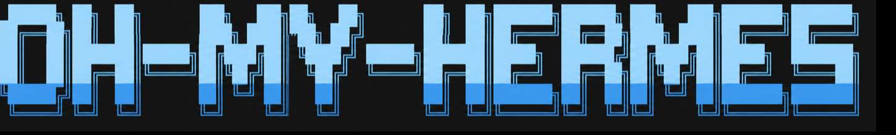
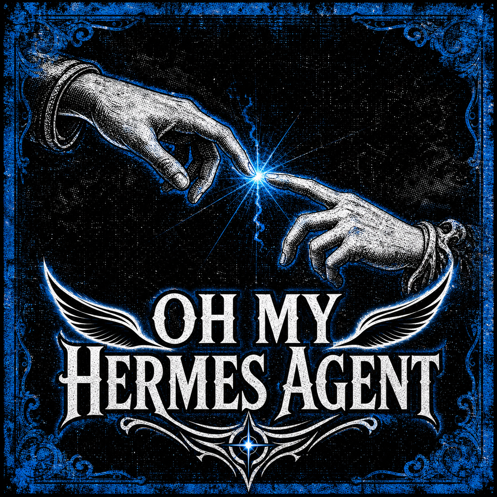
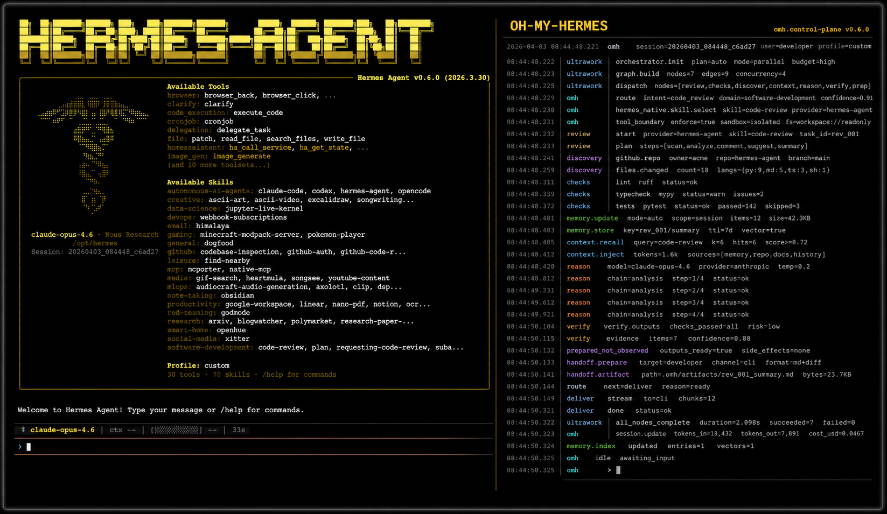
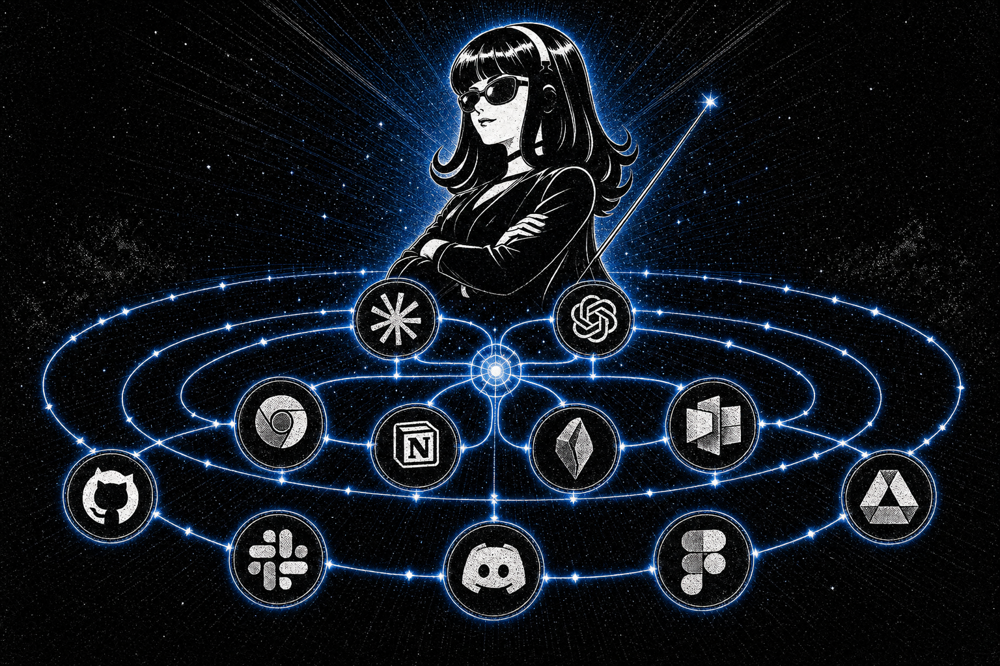

<p align="center">
  
</p>

<table align="center">
  <tr>
    <td width="50%" align="center">
      <br>
      <sub><b>Hermes デスクトップ、oh-my-hermes とともに。</b><br>ワークフローを選ぶと、作る前に確認します。</sub>
    </td>
    <td width="50%" align="center">
      <br>
      <sub><b>Hermes CLI、oh-my-hermes とともに。</b><br>使っているターミナルで同じワークフローを。</sub>
    </td>
  </tr>
  <tr>
    <td width="50%" align="center">
      <br>
      <sub><b>Hermes メッセンジャーアプリ、oh-my-hermes とともに。</b><br>スレッドで依頼すると同じスレッドに返ります。</sub>
    </td>
    <td width="50%" align="center">
      <br>
      <sub><b><code>omh setup</code>、コマンド一つで。</b><br>ワークフローをインストールし、Hermes に接続します。</sub>
    </td>
  </tr>
</table>

# oh-my-hermes

<p align="center">
  <a href="README.md">English</a> |
  <a href="README.ko.md">한국어</a> |
  <a href="README.ja.md">日本語</a> |
  <a href="README.zh.md">中文</a>
</p>

<p align="center">
  <a href="https://github.com/rlaope/oh-my-hermes"></a>
  <a href="https://github.com/NousResearch/hermes-agent"></a>
  <a href="https://github.com/rlaope/oh-my-hermes"></a>
  <a href="https://github.com/NousResearch/hermes-agent"></a>
</p>

<p align="center">
  
</p>

<p align="center">
  <strong>一度インストールするだけ。Hermes はそのまま、より強い運用レイヤーを追加します。</strong>
  <em>計画、調査、制作、コーディング handoff、運用、プロジェクト記憶を明確な証拠境界とともに提供します。</em>
</p>

<p align="center">
  
</p>

**oh-my-hermes**（OMH）は、
[Hermes Agent](https://github.com/NousResearch/hermes-agent) への通常の依頼を、
適切な機能、有用な次の行動、そして実際に起きたこと・まだ起きていないことの
正直な状態へ変換します。Hermes を置き換えたり、コーディング executor を
隠したりせず、既存の Hermes ワークフローを強化します。

[Website](https://rlaope.github.io/oh-my-hermes/) ·
[Documentation](docs/README.md) ·
[Installation](docs/INSTALLATION.md) ·
[Capabilities](docs/CAPABILITIES.md) ·
[Capability Impact](docs/CAPABILITY_IMPACT.md) ·
[Agent Install](INSTALL_FOR_AGENTS.md) ·
[GitHub Pages site](site/index.html)

> [!NOTE]
> OMH は Hermes を自然言語の窓口として維持し、明確な証拠境界を持つプロ向け
> の運用レイヤーを追加します。
>
> <p align="center">
>   
> </p>
>
> <p align="center">
>   
> </p>
>
> <p align="center">
>   
> </p>
## クイックスタート

**ローカルコマンドと管理対象 skill をインストールします:**

```sh
curl -fsSL https://raw.githubusercontent.com/rlaope/oh-my-hermes/main/install.sh | sh
omh setup
```

**Windows（PowerShell 5.1+）の場合:**

```powershell
irm https://raw.githubusercontent.com/rlaope/oh-my-hermes/main/install.ps1 | iex
omh setup
```

**Hermes skill tap:**

```sh
hermes skills tap add rlaope/oh-my-hermes
hermes skills install rlaope/oh-my-hermes/skills/omh-routing --yes
```

**または Your AI Agent に依頼します:**

```text
Hey Agent, Install this >> https://github.com/rlaope/oh-my-hermes <<
```

**アップデートと状態チェック:**

```sh
omh update
omh doctor
```

`--full` インストールを core に戻すようなメンテナンス手順は
[Installation](docs/INSTALLATION.md#reconciling-an-existing-full-install-back-to-core)
にあります。

## 推奨モデル

OMH には次の編集可能なカテゴリ別推奨モデルが含まれています。

| カテゴリ | 推奨モデル |
| --- | --- |
| `ultrabrain` | GPT-5.6 Sol |
| `deep` | GPT-5.6 Terra |
| `unspecified-high` | Kimi K3、次に Claude Opus 5 |
| `unspecified-low` | GLM 5.2、次に GLM 5.2 Ultrafast |
| `visual-engineering` | Claude Fable 5、次に Kimi K3 |

Hermes に **モデルをセットアップして** と頼むと、確認や変更ができます。
これは編集可能な優先設定であり、benchmark 結果ではありません。詳しい設定、
fallback、provider、所有権のルールは
[Guided Model Setup](docs/INSTALLATION.md#guided-model-setup) を参照してください。

## ウルトラスキル

<p align="center">
  
</p>

12 個の `ulw-` workflow。チャットでトリガーを言えば Hermes がルーティング —
全カタログは [Workflow Reference](docs/WORKFLOWS.md)。

| Skill | 何をするか |
| --- | --- |
| ⚡ `ulw-context` | レビュー済みのプロジェクト用語を揃え、確認済み候補を取り込み、用語にルーティング権限を与えず次の判断点を質問します。 |
| ⚡ `ulw-interview` | 何が欲しいのか正確に分かるまで、一度に一つずつ質問します。 |
| ⚡ `ulw-research` | 実際のコードとウェブを調べ、出典を残し、怪しければ裏取りします。 |
| ⚡ `ulw-plan` | 選択肢の比較、リスク、完了基準まで合意したレビュー済み計画を作ります。 |
| ⚡ `ulw-work` | 承認済み計画を、同じファイルに触れない並列レーンで実行します。 |
| ⚡ `ulw-ralph` | 一人が最後まで責任を持つ — 実装、検証、レビューを通るまで反復。 |
| ⚡ `ulw-team` | 複数のワーカー、一つのタスクリスト、衝突なし。 |
| ⚡ `ulw-loop` | 計画 → 実装 → レビューを、ゴールが本当に通るまで回します。 |
| ⚡ `ulw-goal` | チェックポイント付きの長期ゴール — コンテキストが消えても止まった所から再開。 |
| ⚡ `ulw-process` | 一つのタスクをリサーチから PR まで最後まで運びます。 |
| ⚡ `ulw-qa` | わざと過酷なシナリオで攻撃し、壊れた所を直します。 |
| ⚡ `ulw-perf` | 本当に遅く高コストな場所を測り、ホットパスを一つずつ修正します。 |
## OMH が追加するもの

OMH は **105 個**のインストール可能な workflow skill を、理解しやすい6つの
機能ファミリーとして提供します。

そのうち 12 個は workflow engine で - `context`, `deep-interview`, `loop`, `ralph`, `ralplan`, `research`, `team`, `ultragoal`, `ultraperf`, `ultraprocess`, `ultraqa`, `ultrawork` - `ulw-` ラベルで表示され、
ステータス行だけでどの種類の skill が動いているか分かります。残り 93 個は `omh-`
を付けます。canonical name はどちらも変わりません。

| 機能ファミリー | Hermes ができること |
| --- | --- |
| **計画と意思決定** | 曖昧な目標を明確にし、レビュー済み計画と durable goal loop を準備します。 |
| **学習と収集** | 情報源の探索、論文説明、データ確認、根拠付き brief を準備します。 |
| **資料とビジュアル制作** | Web、画像、文書、スライド、PDF、ポスターを形式別の品質 gate とともに制作します。 |
| **コーディング委任と出荷** | Codex、Claude Code、Hermes runtime、または選択した executor 向けの handoff を準備します。 |
| **運用と観測** | セットアップ、サービス品質、リリース、障害、automation、session、workflow learning を確認します。 |
| **知識の保持** | レビュー済みプロジェクト記憶を構築し、外部知識システムを provider-neutral な境界で接続します。 |

完全な catalog、trigger、harness、証拠ルールは
[Workflow Reference](docs/WORKFLOWS.md) にあります。

**ハイライト**

| 機能 | 使い方 | 内容 |
| --- | --- | --- |
| 🧭 **明確化と計画** | `omh-plan` · `omh-decide` · `omh-meeting-brief` | 曖昧な依頼を、明確な目標・制約・トレードオフ・受け入れ基準、そしてそのまま引き渡せる計画に変えます。 |
| ⚡ **レバレッジを効かせた実行** | `omh-idea-to-deploy` · `omh-cto-loop` · `omh-running-work-board` | 高速な並列作業から持続的な複数ステップの実行までスケールしながら、所有権・チェックポイント・検証を常に可視化します。 |
| 🔬 **調査と学習** | `omh-best-practice-research` · `omh-research-brief` · `omh-paper-learning` | 鮮度・情報源の質・未解決の不確実性の境界を示しながら、根拠に基づく証拠を収集・統合します。 |
| 🛠️ **安全なコーディングと出荷** | `omh-code-review` · `omh-build-failure-triage` · `omh-verification-gate` | executor に依存しないコーディング作業を準備し、review・QA・CI・merge に関する主張は観測された証拠にのみ基づかせます。 |
| 🎨 **洗練された成果物の制作** | `omh-design-quality-gate` · `omh-materials-package` · `omh-deliverable-package` · `omh-image-cards` | コンテンツ・完成度・アクセシビリティ・レンダリング品質ゲートを軸に、Web サイト、ビジュアル、レポート、スライド、ドキュメント、PDF、ポスター、パッケージを制作します。 |
| 🧠 **記憶と運用** | `omh-memory-new` · `omh-memory-sync` · `omh-ops-observability-card` · `omh-doctor` | プロジェクト記憶をレビュー優先で保ち、運用の準備状況を可視化し、provider やシステム状態を作り話にせず次の修復アクションを示します。 |
| 🔌 **境界を隠さない接続** | `omh-toolbelt-readiness` · `omh-external-connector-readiness` · `omh-agent-board` | 作業がそれに依存する前に、必要なツール・connector・agent 面が実際に使えるかを確認し、host のロード・ツール利用・外部 provider アクセスを個別に観測可能な状態に保ちます。 |
## 実務向けの設計

<p align="center">
  
</p>

> **OMH (Oh-My-Hermes)** — 誰でも hermes-agent をプロフェッショナルに使えるようにします。<br>
> あなたの AI エージェントのための強力なインテリジェンスハーネスです。

**🧭 コマンド一覧ではなく、より賢いルーター。** 英語、韓国語、日本語、中国語、
スペイン語、フランス語、ドイツ語、ヒンディー語の依頼を、翻訳 API なしで
ローカルに分類します。OMH は推奨ファミリー、skill、owner、次の行動、そして
まだ証拠になっていない部分をあわせて返します。

**🤝 より良いコーディング handoff。** リポジトリの制約、合意済み scope、
worktree と session-isolation の指針、ローカルで利用可能な skill、受け入れ
基準、review の期待値、verification gate を含められます。Codex、Claude
Code、Hermes、generic executor はいずれも隠れたデフォルトにはならず、明示的
な owner のままです。

**🎨 品質を意識した制作。** Frontend、アクセシビリティ、画像、レポート、
スライド、ドキュメント、スプレッドシート、PDF、ポスター、共有パッケージの
依頼は専用の制作・QA ガイダンスを経由します。準備済みのブリーフを、生成済み
や視覚的に検証済みの成果物であるかのようには扱いません。

**🔍 主張より先に証拠。** OMH は準備された意図、観測された runtime イベント、
検証済みの結果を区別します。executor が実行した、review が通った、CI が
成功した、デプロイが完了した、PR が merge されたと主張しなくても、handoff
は準備完了になり得ます。

**🧠 レビュー優先のプロジェクト記憶。** OMH はプロジェクト記憶の候補を
承認済みの記録と分けて管理し、レビュー済みで準備された文脈だけを以降の
handoff に呼び戻します。不透明な Hermes 内部の記憶を読んだり書き換えたりし
たとは主張しません。

**🔌 provider-neutral な運用。** metric、wiki、browser、image、video、
connector の各システムは、明示的な外部 provider contract の背後にありま
す。実際に接続・呼び出しをしていない provider を使ったと主張することなく、
提供されたデータを検証・分析できます。

**🏛️ Hermes-native かつ executor-neutral なアーキテクチャ。** Hermes は
引き続きチャット、明確化、計画、調査、状態表示の窓口です。選択された
executor が実装を担い、OMH はその作業を取り巻くローカル contract、ルー
ティング、記憶、品質ゲート、証拠境界を提供します。

**🧱 local-first な control plane。** OMH のコアとなるルーティング、
catalog、manifest、主張ルールは決定的なローカル表面です。外部呼び出しや
provider アクセスは、コア内部に隠された挙動ではなく、明示的な統合であり続
けます。
## 主張より証拠

OMH は自分が見たことだけを起きたと報告します。表示される状態は常に「どの段階か」と「OMH がどれだけ確信しているか」の二部構成です。

| 表示 | 意味 |
| --- | --- |
| `Plan · not run` | prompt や plan の準備ができています。**まだ何も動いていません。** |
| `Code · running` | executor が今動いており、OMH が観測しています。 |
| `Code · reported done` | executor が終わったと言いました。結果は誰も確認していません。 |
| `Test · verified` | test、review、CI gate が実際に通過しました。 |

重要なのは下から二番目の行です。executor が終わったと言うことと結果が確認されたことは別ですが、多くのツールは両方を「完了」と書きます。
## ドキュメント

- [ドキュメントマップ](docs/README.md)
- [インストールと更新](docs/INSTALLATION.md)
- [製品方針と境界](docs/DIRECTION.md)
- [アーキテクチャ](docs/ARCHITECTURE.md)
- [機能 manifest](docs/CAPABILITIES.md)
- [Workflow reference](docs/WORKFLOWS.md)
- [ロール](docs/ROLES.md)
- [活用事例](docs/APPLICATION_CASES.md)
- [リリースと開発](docs/RELEASE.md)
## 開発

```sh
PYTHONPATH=tests uv run python -m unittest discover -s tests -v
uv run python -m compileall -q src tests
uv run python -m omh.cli docs workflows --check
git diff --check
```

OMH は [Team Art & Engineering](https://rlaope.github.io/artengine-lab/) の
オープンプロジェクトとして開発されています。更新情報は
[@rlaope](https://github.com/rlaope) で確認できます。
